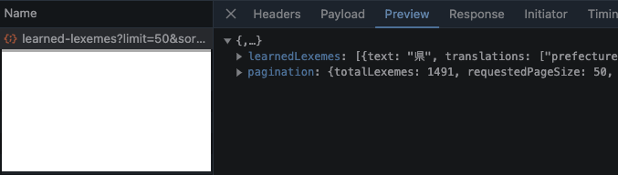
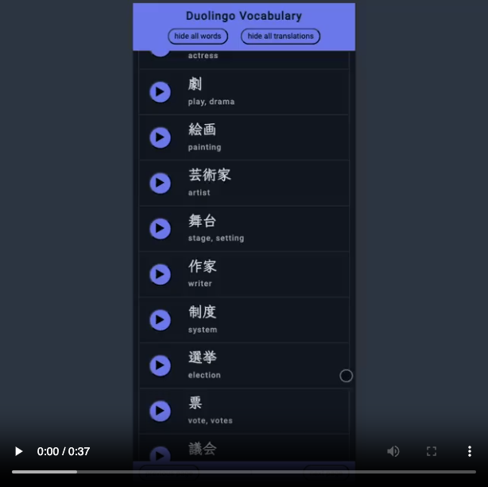
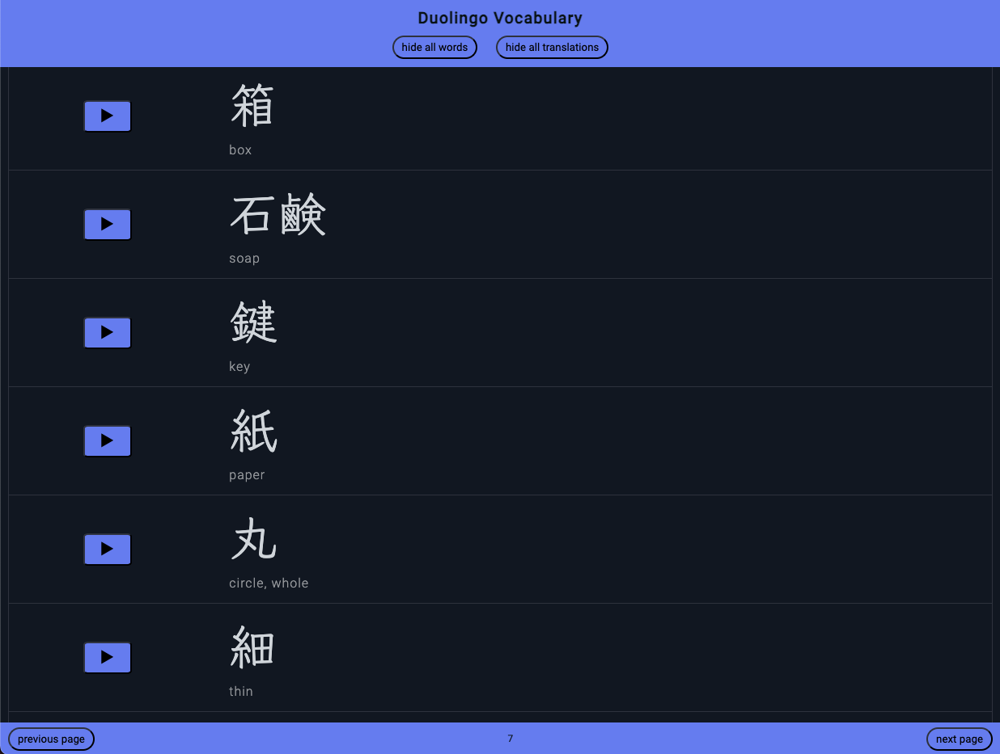
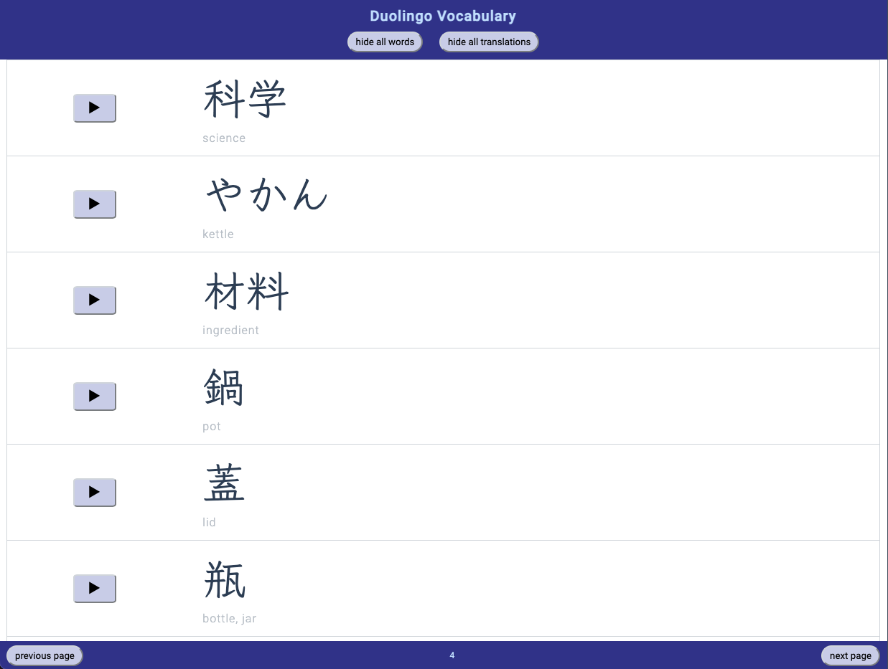
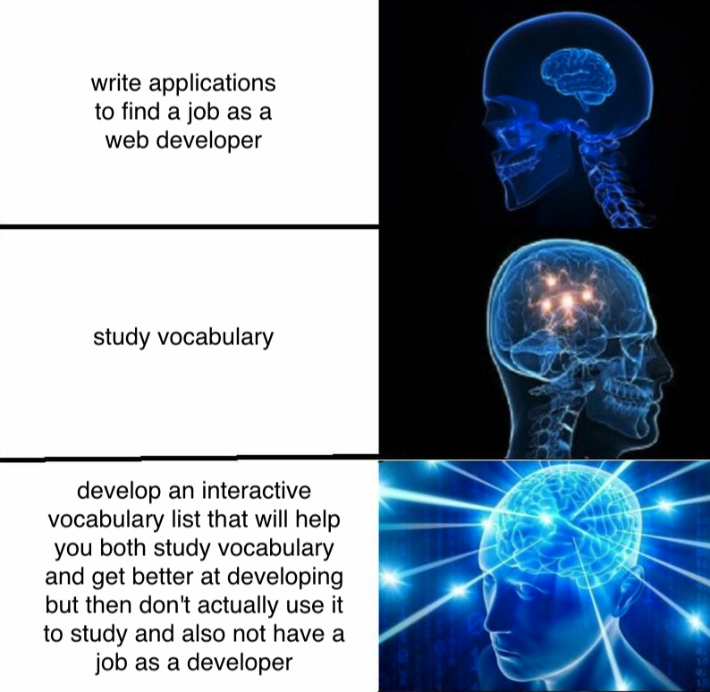

# Duolingo Vocabulary

## What?

A personal vocabulary list with data from duolingo where you can hide/show all the learned words and translations at once or manually and also play audio files.

## Why?

I wanted to build something very simple in vanilla js for a change so I made this interactive vocabulary list from my latest learned words in duolingo. It didn't turn out as simple as planned but what's simple anyways. The source file is not included since I obviously don't own the rights to it, but I made a dummy json to show how it should look. To get your personal words you can log in to your duolingo account in the browser, then go to duolingo.com/practice-hub/words and access the file through the dev tools. it looks like this:

When you load more content on the page, there is a new file created for each 50 words. I took several of these and put them together in the one file I got my data from.

## Preview

The demo video shows how the code works with the data included.

There is a dark mode and versions for desktop and mobile.

## Conclusion

I totally did not waste the whole weekend on this project and absolutely did not start it just to have another reason to procrastinate what I should be actually doing.

